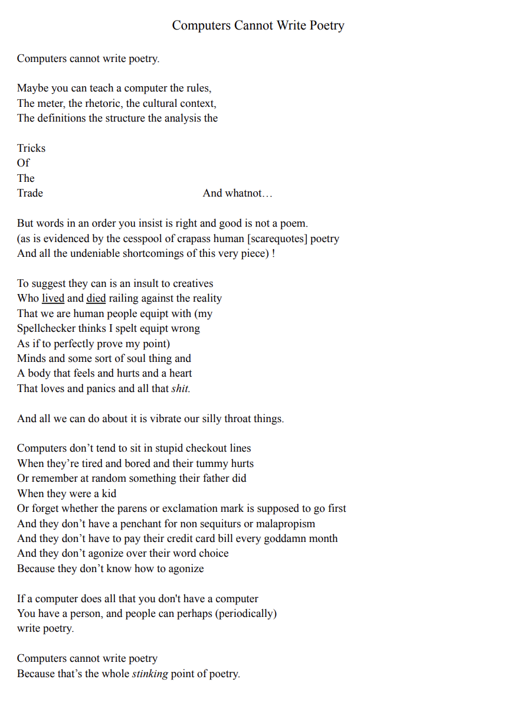

# POETRY SLAM

## Overview
**_CSCI 3725 Computational Creativity_: M7 - Poetry Slam**

**Author**: Lily Huynh

**Last Updated**: November 26, 2024

This project was developed in **CSCI 3725 Computational Creativity** to create, in our terms, creative poems from our computational system. This project challenged my ideas of what I consider a "poem", what are my restrictions to poem creation, how involved can a "human" be for the system to be still computationally creative during generation, etc.

Within my process, I set myself a couple of goals in terms of what my ideal poem to be generated should be:
1. Follows a **Acrostic Poem** format, where the first letter of each word corresponds to the secret letter of the secret word.
2. Must follow a randomly generated **rhyme scheme**, where the last word must match the pattern rhyme
3. Must make **coherent sense**, where the sentence is understandable

I, originally, had other goals I wanted to reach as well, but due to time constraints and difficulties implementing, I was not able to reach these goals. These goals being:
- Each line within the poem must be EXACTLY **10 syllables**
- The overall poem **theme** must be related to the secret word given


### Generation Process
My poem generation process uses backtracking techniques, NLTK's (Natural Language Toolkit) brown corpus words and ngrams, pronouncing's rhymes, and spacy's syllables counter. While these parts were implemented, some of these generation processes have limitations/bugs that I will later address.

#### 1. Backtracking
Similar to a sudoku program, you want to backtrack if the move is invalid in its given context until you find the next valid move after recursively backtracking. I used this same idea by calling backtrack when the next word chosen is invalid or already used before at the sentence index. Whenever it backtracks, it updates the current sentence syllable count and word list to ensure that it stays on track.

> [!NOTE]
> **What is considered a VALID next word?** A word is valid for either 3 cases: (1) If it is the first word and the first letter matches the given secret letter; (2) If it is not the first word and the new word syllables is less than the MAX syllables (i.e. 10 syllables); (3) If it is not the first word and the new word syllables is equal to the MAX syllables, does it rhyme if a previous rhyme was given.

#### 2. NLTK Corpus Brown Words & Ngrams
Fortunately for me, I do not have to scower the internet for commonly found words in a english sentence. While this does limit my vocabulary, it is a start to generating coherent sentences along with the ngrams function. The idea of ngrams is based on the n value, find the next possible word given the n words before it. For example, if the clause was "the quick", the n at this point would be 2. My ngrams function returns a list of unique next words commonly found after the clause "the quick"! Whenever the sentence structure is greater than or equal to 3 words, then the program works in trigrams.

This is because, previously, I was incrementing n by the current sentence generated length. However, I noticed that after 4-5 words in a sentence, the number of ngram next words generated is very limited (usually 1). Thus, utilizing trigrams (3-grams) after 3 words have been generated allows for coherence, but also creativity in generation so it does not plagiarize based on NLTK brown's corpus.

#### 3. Pronouncing's Rhymes
Within the Pronouncing package, you can give it some word (only works with English) and it returns a list of rhyming words to the given word. Thus, I used this functionality to check if the next word chosen is in the produces rhymes list from a given rhyme if it is the last word.

#### 4. Spacy's Syllables
To ensure that each sentence is EXACTLY 10 syllables, for each word object I create, it counts the number of syllables from the given word using spacy's "en-core-web-sm" and tokenizing the word to count the number of syllables.

### Version Control
This project uses Git an GitHub for tracking commits and managing project development. Please see the GitHub repository for the full development of the application:
https://github.com/lilynhuynh/M7-poetry-slam

## Setup
> [!NOTE]
> Please install **flask, flask_cors, nltk, spacy, pronouncing, collections** and **collections** prior to running the program. The poem generation will not work properly if not installed beforehand. If you have any issues with accessing certain downloads within packages like brown within NLTK, even after running `nltk.download('<resource>')`. Please implement this at the top of the python file it is erroring out on to download the file:
```
import ssl
try:
    _create_unverified_https_context = ssl._create_unverified_context
except AttributeError:
    pass
else:
    ssl._create_default_https_context = _create_unverified_https_context

nltk.download('brown')
```

To run the code, please open the `__init__.py` file within the `scripts` folder and if you are using _Visual Studio Code_ (VSCode), you can click the play button in the top right corner. If your are not using VSCode, you can also open up the terminal and cd into the project folder. Once in the project folder, you can write one of the following commands into the terminal depending on the python installed on your device: `python __init__.py` or `python3 __init__.py`.

The terminal should then open a Flask app in debug mode. It should give you a url to open the `index.html` on. For example, the line should look like `Running on http://127.0.0.1:5000` after the `Debug mode: on` line. Copy and paste the http link given and it should open up the front-end on your browser!

## Usage
This program can be accessed by cloning the repository from the provided GitHub link above and running the `__init__.py` within the `scripts` folder.
> [!CAUTION]
> Please refer to the **Setup** section before running the program.

## Limitations
While packages such as spacy, NLTK (brown), and Pronouncing offer shortcuts and resources to help with language generation, they do have their shortcomings. I will list the issues I encountered while using these packages and how it affected my outcome (as of now).
- spacy's syllables counter is limited and sometimes inaccurate. For example, some words that would have 2 syllables, would be considered 1. I do not know if this is because of only using "en-core-web-sm", but this made for inaccurate current syllable counts.
- Since I was using brown's corpus words, it limited the vocabulary I was able to use. However, whenever I used NLTK's overall string.words, it vastly expanded the vocabulary, but it also included uncommon words. For example, it would string a bunch of random words together and it led to incoherence within sentence generation.
- Expanding from using a limited vocabulary, there are some words that are very "unique" in that Pronouncing cannot recognize them. Thus, if there is a given rhyme but the previous word was super outlandish or not recognized by Prouncing, it will output a empty rhyme list.

Given all these limitations, this affected the goals I wanted to reach by the time of my deadline (November 26, 2024). This being my poem having a rhyme scheme. Because the syllable counter was not working properly with the backtracking method, it led to inaccurate syllable counts and non-rhyme words being considered rhymes. Furthermore, since the syllable counter was inaccurate at some points, some sentences would be more or less than 10 syllables sometimes as well.

_However, please note, that this is a ongoing project that I DO want to expand on and perfect to reach these goals in my own time in the future!_

Furthermore, a lot of the user-responsiveness (i.e. detailing the process and updating the user on the current progress of poem generation) is done within the browser's console and terminal where the user is running the Flask app. Thus, if the user were to ONLY view the front-end, it would be very "non-responsive". I recommend that after clicking the `Generate Your Poem` button on the front-end, please open the console on your browser to see its response and open up the terminal you are running the Flask app on to see the poem generation process!

The current program also does not have a feature to rate and save poem being generated. As stated before, this is a feature I would like to implement in the future on my own time to store and maybe even display past poems generated.

Last of all, the main limitation of this program is its long poem generation time. The goal is to cache and quicken the poem generation process so that it is more efficient in the future.

## Additional Resources
For this project, I presented the system to our class and linked below are the materials used for this [presentation](https://docs.google.com/presentation/d/1kPE7Zcxg92tjISDB9xe3qwr_K5PMWaIqNHvijLPey2Q/edit?usp=drive_link).

## Acknowledgements
I want to acknowledge that some of the features, especially the JavaScript features for `mousehover-effect.js` and `text-to-screen-and-speech.js`. Furthermore, lots of the features/base ideals for the poem generation were from scholarly articles. These acknowledgements will be detailed below.

| Feature | Author | Description | File & Source Link |
| :--- | :----- | :--------- | :----- |
| **Mousehover Effect** | Online Tutorials (2023) | Used this source code to build the cursor-letter effect on the front-end. | `static/mousehover-effect.js`<br>https://www.youtube.com/watch?v=tsLaU1evEPQ&t=629s |
| **Typewriter Effect** | Geoff Graham (2022) | Used this source code to build the typewriter effect for each line after the poem data is received. | `static/text-to-screen-and-speech.js`<br>https://css-tricks.com/snippets/css/typewriter-effect/ |
|**Ngrams Generation** | Robert P. Levy (2001) | Used to base ideas of rhymes, and future implementation of syllable stresses and fitness function | `word.py` and `poem.py`<br>https://citeseerx.ist.psu.edu/document?repid=rep1&type=pdf&doi=85edc0fad667e898f219a7f0b74d74976040178e |
| **Acrostic Poem** | Rajat Agarwal, Katharina Kann (2020) | Used to base ideas on using a secret word to generate the first letter of each sentence and theme | `sentence.py` and `poem.py`<br>https://arxiv.org/pdf/2010.02239 |
| **Narrative Elements** | Yongkang Wong, Shaojing Fan, Yangyang Guo, Ziwei Xu, Karen Stephen, Rishabh Sheoran, Anusha Bhamidipati, Vivek Barsopia, Jianquan Liu, Mohan Kankanhalli (2022) | (Not implemented yet) Used to generate key narrative elements to create thematic poems, to future implement using web scraping | `poem.py`<br>https://dl.acm.org/doi/abs/10.1145/3503161.3549202 |

## Closing Statement
Last of all, I would like to close this README with a poem my partner wrote about this project's initiative overall - which summed up my whole experience trying to build a "computationally creative system that generates poetry".



Feel free to download the [pdf](assets/Computers%20Cannot%20Write%20Poetry.pdf) version for viewing
